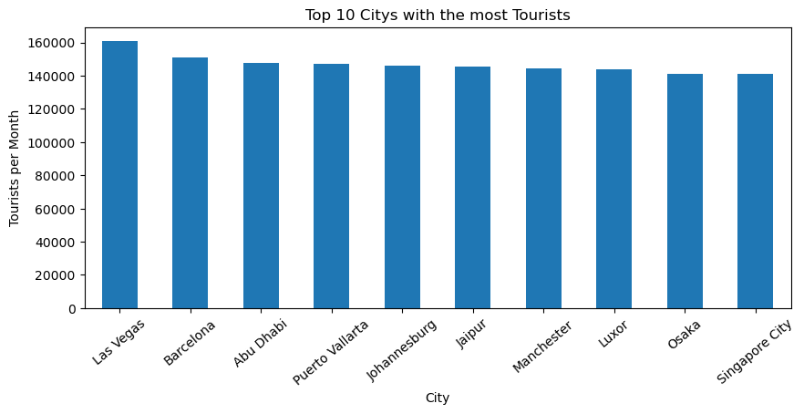
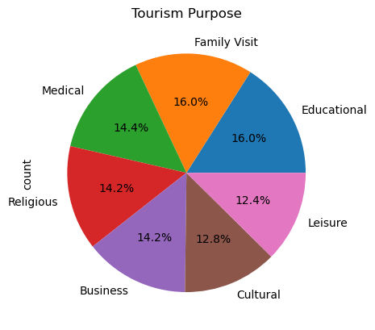

### Importing


```python
import pandas as pd
import numpy as np
import matplotlib.pyplot as plt
import seaborn as sns
```

### Load CSV files


```python
df = pd.read_csv("Tourism_Hospitality_Industry_Analysis.csv")
df.head()
```


<div>
<style scoped>
    .dataframe tbody tr th:only-of-type {
        vertical-align: middle;
    }

    .dataframe tbody tr th {
        vertical-align: top;
    }

    .dataframe thead th {
        text-align: right;
    }
</style>
<table border="1" class="dataframe">
  <thead>
    <tr style="text-align: right;">
      <th></th>
      <th>Country</th>
      <th>City</th>
      <th>Year</th>
      <th>Month</th>
      <th>Number_of_Tourists</th>
      <th>Purpose_of_Visit</th>
      <th>Average_Length_of_Stay</th>
      <th>Tourist_Spending_USD</th>
      <th>Hotel_Occupancy_Rate</th>
      <th>Number_of_Hotels</th>
      <th>...</th>
      <th>Employment_in_Tourism</th>
      <th>Contribution_to_GDP_Percent</th>
      <th>Number_of_Flights</th>
      <th>Airport_Passenger_Traffic</th>
      <th>Transport_Infrastructure_Quality</th>
      <th>Eco_Tourism_Revenue_USD</th>
      <th>Carbon_Footprint_kg</th>
      <th>Waste_Management_Rating</th>
      <th>Tourist_Satisfaction_Score</th>
      <th>Number_of_Online_Reviews</th>
    </tr>
  </thead>
  <tbody>
    <tr>
      <th>0</th>
      <td>Italy</td>
      <td>Venice</td>
      <td>2022</td>
      <td>2</td>
      <td>171958</td>
      <td>Cultural</td>
      <td>12.4</td>
      <td>1325.46</td>
      <td>79.0</td>
      <td>70</td>
      <td>...</td>
      <td>21850</td>
      <td>2.9</td>
      <td>3944</td>
      <td>225203</td>
      <td>2.3</td>
      <td>48484.36</td>
      <td>21075968.92</td>
      <td>7.5</td>
      <td>9.7</td>
      <td>2533</td>
    </tr>
    <tr>
      <th>1</th>
      <td>India</td>
      <td>Mumbai</td>
      <td>2020</td>
      <td>3</td>
      <td>55311</td>
      <td>Religious</td>
      <td>14.9</td>
      <td>3278.67</td>
      <td>70.6</td>
      <td>302</td>
      <td>...</td>
      <td>46434</td>
      <td>12.6</td>
      <td>2547</td>
      <td>704811</td>
      <td>9.8</td>
      <td>19620.39</td>
      <td>7535713.00</td>
      <td>6.6</td>
      <td>6.9</td>
      <td>1367</td>
    </tr>
    <tr>
      <th>2</th>
      <td>Japan</td>
      <td>Tokyo</td>
      <td>2022</td>
      <td>4</td>
      <td>81551</td>
      <td>Leisure</td>
      <td>8.1</td>
      <td>4369.73</td>
      <td>74.0</td>
      <td>378</td>
      <td>...</td>
      <td>15627</td>
      <td>18.9</td>
      <td>2561</td>
      <td>255041</td>
      <td>4.5</td>
      <td>19240.21</td>
      <td>15686948.95</td>
      <td>3.2</td>
      <td>8.4</td>
      <td>875</td>
    </tr>
    <tr>
      <th>3</th>
      <td>United Kingdom</td>
      <td>Manchester</td>
      <td>2021</td>
      <td>1</td>
      <td>160510</td>
      <td>Educational</td>
      <td>4.3</td>
      <td>2259.77</td>
      <td>49.1</td>
      <td>437</td>
      <td>...</td>
      <td>16653</td>
      <td>5.0</td>
      <td>4343</td>
      <td>221829</td>
      <td>1.3</td>
      <td>94513.26</td>
      <td>44927014.38</td>
      <td>4.6</td>
      <td>9.6</td>
      <td>7729</td>
    </tr>
    <tr>
      <th>4</th>
      <td>Egypt</td>
      <td>Luxor</td>
      <td>2022</td>
      <td>12</td>
      <td>141387</td>
      <td>Cultural</td>
      <td>2.6</td>
      <td>1963.99</td>
      <td>59.4</td>
      <td>387</td>
      <td>...</td>
      <td>26271</td>
      <td>7.8</td>
      <td>879</td>
      <td>566588</td>
      <td>2.3</td>
      <td>69573.18</td>
      <td>18354896.74</td>
      <td>9.9</td>
      <td>8.9</td>
      <td>2127</td>
    </tr>
  </tbody>
</table>
<p>5 rows × 23 columns</p>
</div>


### Summary Statistics


```python
df.describe()
```


<div>
<style scoped>
    .dataframe tbody tr th:only-of-type {
        vertical-align: middle;
    }

    .dataframe tbody tr th {
        vertical-align: top;
    }

    .dataframe thead th {
        text-align: right;
    }
</style>
<table border="1" class="dataframe">
  <thead>
    <tr style="text-align: right;">
      <th></th>
      <th>Year</th>
      <th>Month</th>
      <th>Number_of_Tourists</th>
      <th>Average_Length_of_Stay</th>
      <th>Tourist_Spending_USD</th>
      <th>Hotel_Occupancy_Rate</th>
      <th>Number_of_Hotels</th>
      <th>Average_Room_Price_USD</th>
      <th>Tourism_Revenue_USD</th>
      <th>Employment_in_Tourism</th>
      <th>Contribution_to_GDP_Percent</th>
      <th>Number_of_Flights</th>
      <th>Airport_Passenger_Traffic</th>
      <th>Transport_Infrastructure_Quality</th>
      <th>Eco_Tourism_Revenue_USD</th>
      <th>Carbon_Footprint_kg</th>
      <th>Waste_Management_Rating</th>
      <th>Tourist_Satisfaction_Score</th>
      <th>Number_of_Online_Reviews</th>
    </tr>
  </thead>
  <tbody>
    <tr>
      <th>count</th>
      <td>500.000000</td>
      <td>500.000000</td>
      <td>500.000000</td>
      <td>500.000000</td>
      <td>500.000000</td>
      <td>500.000000</td>
      <td>500.000000</td>
      <td>500.000000</td>
      <td>500.000000</td>
      <td>500.000000</td>
      <td>500.000000</td>
      <td>500.000000</td>
      <td>500.000000</td>
      <td>500.000000</td>
      <td>500.000000</td>
      <td>5.000000e+02</td>
      <td>500.000000</td>
      <td>500.000000</td>
      <td>500.000000</td>
    </tr>
    <tr>
      <th>mean</th>
      <td>2022.052000</td>
      <td>6.418000</td>
      <td>125263.884000</td>
      <td>8.672000</td>
      <td>2796.037840</td>
      <td>64.840800</td>
      <td>273.624000</td>
      <td>273.980500</td>
      <td>349737.916220</td>
      <td>27075.152000</td>
      <td>10.492200</td>
      <td>2756.668000</td>
      <td>523780.320000</td>
      <td>5.434600</td>
      <td>59210.029300</td>
      <td>3.721937e+07</td>
      <td>5.225400</td>
      <td>7.438600</td>
      <td>5118.416000</td>
    </tr>
    <tr>
      <th>std</th>
      <td>1.387496</td>
      <td>3.410357</td>
      <td>43037.380881</td>
      <td>3.644638</td>
      <td>1346.289218</td>
      <td>14.582304</td>
      <td>129.022433</td>
      <td>127.754045</td>
      <td>214140.887151</td>
      <td>12460.250332</td>
      <td>5.525876</td>
      <td>1249.541703</td>
      <td>271162.524517</td>
      <td>2.558452</td>
      <td>46533.191144</td>
      <td>2.056586e+07</td>
      <td>2.596486</td>
      <td>1.446387</td>
      <td>2944.440248</td>
    </tr>
    <tr>
      <th>min</th>
      <td>2020.000000</td>
      <td>1.000000</td>
      <td>50887.000000</td>
      <td>2.000000</td>
      <td>501.020000</td>
      <td>40.000000</td>
      <td>50.000000</td>
      <td>50.570000</td>
      <td>34185.350000</td>
      <td>5009.000000</td>
      <td>1.100000</td>
      <td>505.000000</td>
      <td>50801.000000</td>
      <td>1.000000</td>
      <td>2299.050000</td>
      <td>6.310887e+06</td>
      <td>1.000000</td>
      <td>5.000000</td>
      <td>110.000000</td>
    </tr>
    <tr>
      <th>25%</th>
      <td>2021.000000</td>
      <td>3.000000</td>
      <td>88694.750000</td>
      <td>5.575000</td>
      <td>1590.332500</td>
      <td>52.575000</td>
      <td>165.750000</td>
      <td>168.357500</td>
      <td>181456.237500</td>
      <td>16977.250000</td>
      <td>5.600000</td>
      <td>1671.500000</td>
      <td>284790.750000</td>
      <td>3.300000</td>
      <td>24657.735000</td>
      <td>2.107205e+07</td>
      <td>3.000000</td>
      <td>6.200000</td>
      <td>2539.000000</td>
    </tr>
    <tr>
      <th>50%</th>
      <td>2022.000000</td>
      <td>6.000000</td>
      <td>124629.000000</td>
      <td>8.900000</td>
      <td>2894.235000</td>
      <td>64.100000</td>
      <td>273.500000</td>
      <td>281.085000</td>
      <td>304511.410000</td>
      <td>27026.000000</td>
      <td>10.500000</td>
      <td>2817.500000</td>
      <td>523268.000000</td>
      <td>5.400000</td>
      <td>44824.205000</td>
      <td>3.248243e+07</td>
      <td>5.000000</td>
      <td>7.400000</td>
      <td>5287.000000</td>
    </tr>
    <tr>
      <th>75%</th>
      <td>2023.000000</td>
      <td>9.000000</td>
      <td>164159.500000</td>
      <td>11.700000</td>
      <td>4011.587500</td>
      <td>77.650000</td>
      <td>379.250000</td>
      <td>381.230000</td>
      <td>496404.080000</td>
      <td>37523.250000</td>
      <td>15.200000</td>
      <td>3793.750000</td>
      <td>757603.500000</td>
      <td>7.700000</td>
      <td>81525.737500</td>
      <td>5.025707e+07</td>
      <td>7.500000</td>
      <td>8.700000</td>
      <td>7729.000000</td>
    </tr>
    <tr>
      <th>max</th>
      <td>2024.000000</td>
      <td>12.000000</td>
      <td>199960.000000</td>
      <td>15.000000</td>
      <td>4983.790000</td>
      <td>89.800000</td>
      <td>498.000000</td>
      <td>499.890000</td>
      <td>951466.740000</td>
      <td>49918.000000</td>
      <td>20.000000</td>
      <td>4997.000000</td>
      <td>998202.000000</td>
      <td>10.000000</td>
      <td>228408.370000</td>
      <td>9.985046e+07</td>
      <td>9.900000</td>
      <td>10.000000</td>
      <td>9979.000000</td>
    </tr>
  </tbody>
</table>
</div>


```python
df.info()
```

    <class 'pandas.core.frame.DataFrame'>
    RangeIndex: 500 entries, 0 to 499
    Data columns (total 23 columns):
     #   Column                            Non-Null Count  Dtype  
    ---  ------                            --------------  -----  
     0   Country                           500 non-null    object 
     1   City                              500 non-null    object 
     2   Year                              500 non-null    int64  
     3   Month                             500 non-null    int64  
     4   Number_of_Tourists                500 non-null    int64  
     5   Purpose_of_Visit                  500 non-null    object 
     6   Average_Length_of_Stay            500 non-null    float64
     7   Tourist_Spending_USD              500 non-null    float64
     8   Hotel_Occupancy_Rate              500 non-null    float64
     9   Number_of_Hotels                  500 non-null    int64  
     10  Hotel_Rating                      500 non-null    object 
     11  Average_Room_Price_USD            500 non-null    float64
     12  Tourism_Revenue_USD               500 non-null    float64
     13  Employment_in_Tourism             500 non-null    int64  
     14  Contribution_to_GDP_Percent       500 non-null    float64
     15  Number_of_Flights                 500 non-null    int64  
     16  Airport_Passenger_Traffic         500 non-null    int64  
     17  Transport_Infrastructure_Quality  500 non-null    float64
     18  Eco_Tourism_Revenue_USD           500 non-null    float64
     19  Carbon_Footprint_kg               500 non-null    float64
     20  Waste_Management_Rating           500 non-null    float64
     21  Tourist_Satisfaction_Score        500 non-null    float64
     22  Number_of_Online_Reviews          500 non-null    int64  
    dtypes: float64(11), int64(8), object(4)
    memory usage: 90.0+ KB
    


```python
df.shape
```


    (500, 23)


```python
df.isnull().sum()
```


    Country                             0
    City                                0
    Year                                0
    Month                               0
    Number_of_Tourists                  0
    Purpose_of_Visit                    0
    Average_Length_of_Stay              0
    Tourist_Spending_USD                0
    Hotel_Occupancy_Rate                0
    Number_of_Hotels                    0
    Hotel_Rating                        0
    Average_Room_Price_USD              0
    Tourism_Revenue_USD                 0
    Employment_in_Tourism               0
    Contribution_to_GDP_Percent         0
    Number_of_Flights                   0
    Airport_Passenger_Traffic           0
    Transport_Infrastructure_Quality    0
    Eco_Tourism_Revenue_USD             0
    Carbon_Footprint_kg                 0
    Waste_Management_Rating             0
    Tourist_Satisfaction_Score          0
    Number_of_Online_Reviews            0
    dtype: int64


### Graphs


```python
""" Top 10 cities frequented by tourists """

top_cities = df.groupby('City')['Number_of_Tourists'].mean().nlargest(10)
top_cities.plot(kind='bar', figsize=(10,4))
plt.title("Top 10 Citys with the most Tourists")
plt.ylabel("Tourists per Month")
plt.xticks(rotation=40)
plt.show()
```


    

    


```python
""" Reason why tourists travel to certain cities """

df['Purpose_of_Visit'].value_counts().plot(kind='pie', autopct='%1.1f%%')
plt.title("Tourism Purpose")
plt.show()
```


    

    


```python
""" Occupancy rate depending on the Hotel Rating """

occupancy_by_hotel_rating = sorted(df['Hotel_Rating'].unique())

sns.boxplot(x='Hotel_Rating', y='Hotel_Occupancy_Rate', data=df, color="yellow", order=rating_order,)
plt.title("Occupancy by Hotel Rating")
plt.ylabel("Hotel Occupancy Rate")
plt.xlabel("Hotel Rating")
plt.xticks(rotation=45)
plt.show()
```


    

    


### What the data looks like
- The dataset is about tourism and hospitality metrics across cities/countries per month
- There are 23 columns and 500 rows in the dataset
- The dataset is complete with no null values
- There are 11 columns with numberic values including decimals (float64), 9 columns with whole number (int64), and 4 columns with text (object)
- The average number of tourists per month is about 125263 people
- The average lenght of stay is 8.67 days
- The average occupancy rate is around 64.84%
- The city revenue each month is an average of 349737 usd
- The most revenue earned a city earned each month is 951466 usd
- Las Vegas is the city that gets the most tourists per month
- The reason for tourism purposes are evenly split
- There is not a big correlation on the occupancy rating being affected by the hotel ratings, therefore hotel ratings do not predict occupancy

### References
- All the summary codes were created by referencing the pandas cheatsheet provided in the course learning hub
- The pandas cheatsheet was used to group by the city and number of tourists to get the mean and the top 10
- Perplexity AI was used to help create the bar chart graph that summarizes the top cities frequented by tourists. Changes were made on the code to adjust the data and visual layout like the size
- https://www.w3schools.com/python/matplotlib_labels.asp was referenced to figure out how to name the title and labels of the graph
- https://matplotlib.org/stable/api/_as_gen/matplotlib.pyplot.xticks.html was referenced to make the labels display at s specific angle (xticks)
- Perplexity AI was used to help create a pie chart graph to determine the reason for travel
- For the boxplot the code to make the graph was referenced from https://www.geeksforgeeks.org/python/boxplot-using-seaborn-in-python/
- Perplexity AI was used to figure out how to sort the values for the boxplot from smallest to largest (order=rating_order)
